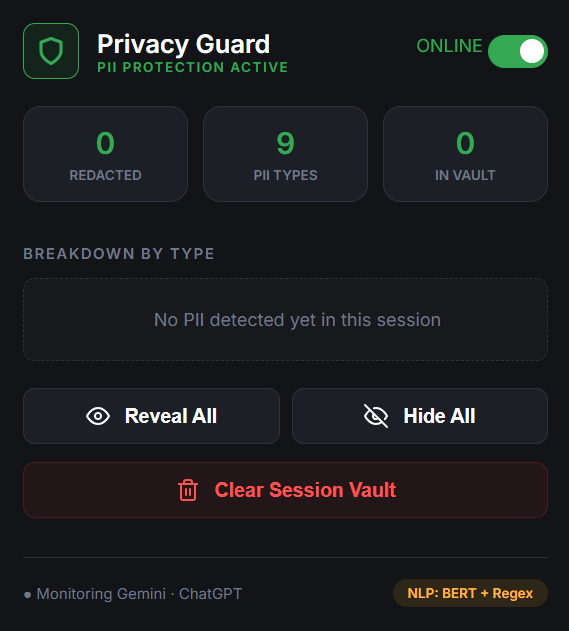

<h1 align="center">🛡️ Privacy Guard</h1>

<p align="center">
  <b>A local-first PII de-identification layer for LLMs (Gemini & ChatGPT)</b>
</p>

<p align="center">
  
</p>

---

## The Mission
Users frequently share sensitive data like API keys, Government IDs, and personal names with AI models. **Privacy Guard** acts as a stealthy "Privacy Layer" that intercepts your prompt, redacts sensitive information locally, and sends a sanitized version to the LLM.

## How It Works
Privacy Guard uses a **Client-Sidecar** architecture to ensure your data stays on your machine during the de-identification process.

1.  **Interception:** The Chrome Extension watches for input events on `chatgpt.com` and `gemini.google.com`.
2.  **Hybrid Engine:** The text is sent to a local **FastAPI** backend that runs:
    * **NLP Layer:** A `BERT-large-cased` model fine-tuned for Named Entity Recognition (NER) to detect names and locations.
    * **Regex Layer:** High-speed pattern matching for structured data like **IP Addresses**, **Aadhaar**, and **PAN cards**.
3.  **Redaction:** Sensitive data is replaced with consistent, session-stable tags (e.g., `<PERSON_1>`, `<IP_ADDRESS_1>`).
4.  **Vaulting:** The original data is stored in a local session vault, allowing you to "Reveal" the original values in the browser UI without the LLM ever seeing them.

---

## Before & After

| PII Category | Original Input | Anonymized Output (To LLM) |
| :--- | :--- | :--- |
| **Personal Identity** | "Hi, I am Ritvik from Vellore." | "Hi, I am `<PERSON_1>` from `<LOCATION_1>`." |
| **Financials** | "My PAN is ABCDE1234F." | "My PAN is `<PAN_CARD_1>`." |
| **Networking** | "Connect to 192.168.1.1" | "Connect to `<IP_ADDRESS_1>`" |
| **Security** | "My API Key is sk-12345..." | "My API Key is `<SECRET_TOKEN_1>`" |

---

## Supported PII Types
The engine currently supports **9 core categories**:
* **Identity:** Person Names, Locations, Email Addresses, Phone Numbers.
* **Finance/Gov:** Indian Aadhaar Cards, PAN Cards.
* **Technical:** IP Addresses, Secret Tokens/API Keys, URI Resources.

---

## Getting Started

### 1. Setup Backend (The Engine)
It is highly recommended to use a virtual environment to keep dependencies isolated.

```bash
# Navigate to backend folder
cd backend

# Create and activate virtual environment
python -m venv venv
# Windows: venv\Scripts\activate | Mac/Linux: source venv/bin/activate

# Install dependencies
pip install -r requirements.txt

### 2. Install Extension
* Open Chrome and navigate to `chrome://extensions/`.
* Enable **Developer mode** (toggle in the top right corner).
* Click **Load unpacked** and select the `extension/` folder from this repository.
* **Critical Step:** Once your FastAPI server is running, go back to the extensions page and click the **Reload icon (↻)** on the Privacy Guard card. This ensures the extension connects to the local backend properly.

### 3. Usage & Activation
* Navigate to [ChatGPT](https://chatgpt.com) or [Gemini](https://gemini.google.com).
* **Refresh the page (F5):** The extension needs a fresh page load to inject the interceptor scripts into the chat interface.
* Start typing! Any detected PII will be redacted before it leaves your browser. Check the extension popup to see your **Session Vault** in action.

# Start the FastAPI server
uvicorn main:app --reload
