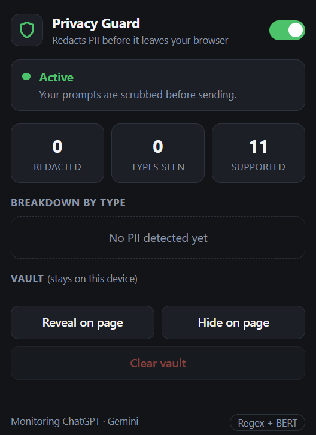

<h1 align="center">🛡️ Privacy Guard</h1>

<p align="center">
  <b>A local-first PII de-identification layer for LLMs (Gemini & ChatGPT)</b>
</p>

<p align="center">
  
</p>

---

## The Mission
Users frequently share sensitive data like API keys, Government IDs, and personal names with AI models. **Privacy Guard** acts as a stealthy "Privacy Layer" that intercepts your prompt, redacts sensitive information locally, and sends a sanitized version to the LLM.

## How It Works
Privacy Guard uses a **Client-Sidecar** architecture to ensure your data stays on your machine during the de-identification process.

1.  **Interception:** The Chrome Extension watches for input events on `chatgpt.com` and `gemini.google.com`.
2.  **Hybrid Engine:** The text is sent to a local **FastAPI** backend that runs:
    * **NLP Layer:** A `BERT-large-cased` model fine-tuned for Named Entity Recognition (NER) to detect names, locations and organisations.
    * **Regex Layer:** High-speed pattern matching for structured data like **IP addresses**, **Aadhaar** (Verhoeff-checked), **cards** (Luhn-checked) and **PAN**.
3.  **Redaction:** Sensitive data is replaced with consistent, session-stable tags (e.g., `<PERSON_1>`, `<IP_ADDRESS_1>`).
4.  **Vaulting:** The original data is stored in a local session vault, allowing you to "Reveal" the original values in the browser UI without the LLM ever seeing them.

---

## Before & After

| PII Category | Original Input | Anonymized Output (To LLM) |
| :--- | :--- | :--- |
| **Personal Identity** | "Hi, I am Ritvik from Vellore." | "Hi, I am `<PERSON_1>` from `<LOCATION_1>`." |
| **Financials** | "My PAN is ABCDE1234F." | "My PAN is `<PAN_CARD_1>`." |
| **Networking** | "Connect to 192.168.1.1" | "Connect to `<IP_ADDRESS_1>`" |
| **Security** | "My API Key is sk-12345..." | "My API Key is `<SECRET_TOKEN_1>`" |

---

## Supported PII Types
**11 categories**:
* **Identity:** Person, Location, Organisation (redacted when unsure), Email, Phone (mobile and landline).
* **Finance/Gov:** Credit/debit cards (Luhn), Aadhaar (Verhoeff), PAN.
* **Technical:** IP addresses, secret tokens / API keys (incl. JWT, AWS, GitHub), URI resources.

Policy: when unsure, redact. A leaked name costs more than an extra tag.

---

## Measured Accuracy
Run on 76 hand-written cases (85 PII strings) with `backend/eval`:

| | Regex only | BERT-large + regex |
| :--- | :--- | :--- |
| Recall | 52.9% | **95.3%** |
| Precision | 100% | 98.8% |
| Names/places/orgs recall | 0% | 90.0% |
| Mean latency per prompt | 0.07 ms | ~110 ms |
| Memory | 18 MB | ~1.6 GB |

Known gaps: lowercase names, names in code comments, library names flagged as ORG. See `roadmap.md`.

---

## Getting Started

### 1. Start the backend
```bash
cd backend
python -m venv venv
# Windows: venv\Scripts\activate | Mac/Linux: source venv/bin/activate
pip install -r requirements.txt
python -m uvicorn main:app --reload
```
The first run downloads the BERT model (~1.3 GB). Wait until the server says it is running.

### 2. Install the extension
* Open `chrome://extensions/`, enable **Developer mode**.
* **Load unpacked** and select the `extension/` folder.
* Open ChatGPT or Gemini and refresh the page (F5).
* Type a prompt and send it (Enter or the Send button). The popup shows status, a per-type breakdown and the vault.

### 3. Run tests and evaluation
```bash
cd backend
pip install pytest "httpx<0.28"
python -m pytest tests
python -m eval.run_eval --engine regex      # fast
python -m eval.run_eval --engine bert --label my-run
```

## Project Layout
```
extension/   Chrome MV3 extension (content/interceptor.js, background.js, popup/)
backend/     FastAPI server: engine.py (regex + BERT), validators.py, main.py
backend/tests/  unit tests      backend/eval/  accuracy + latency harness
roadmap.md   what is done and what is next (ONNX)
```
